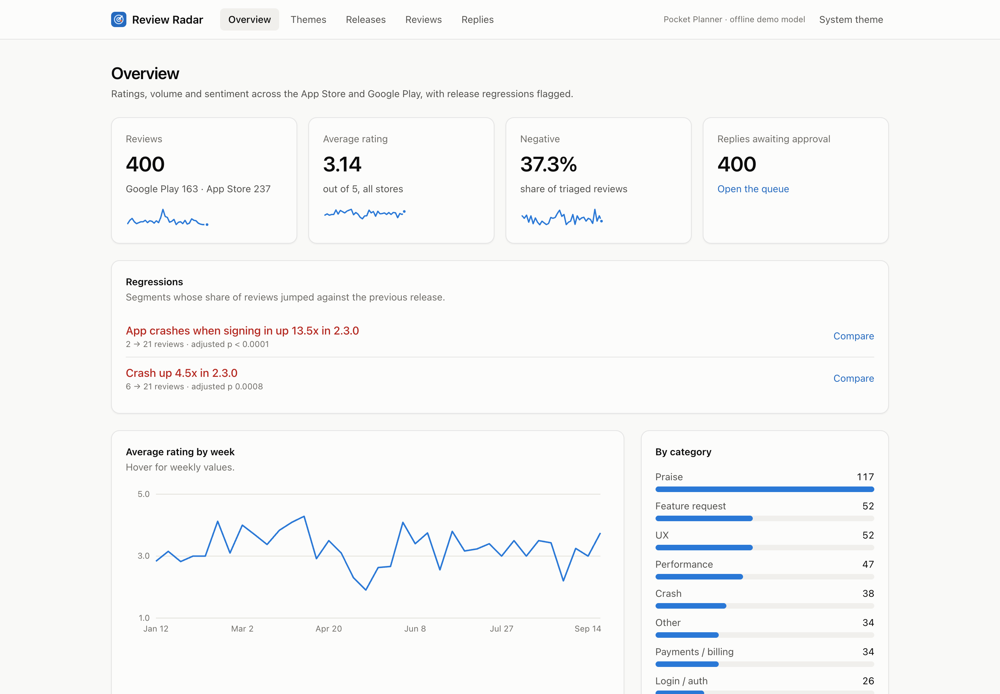
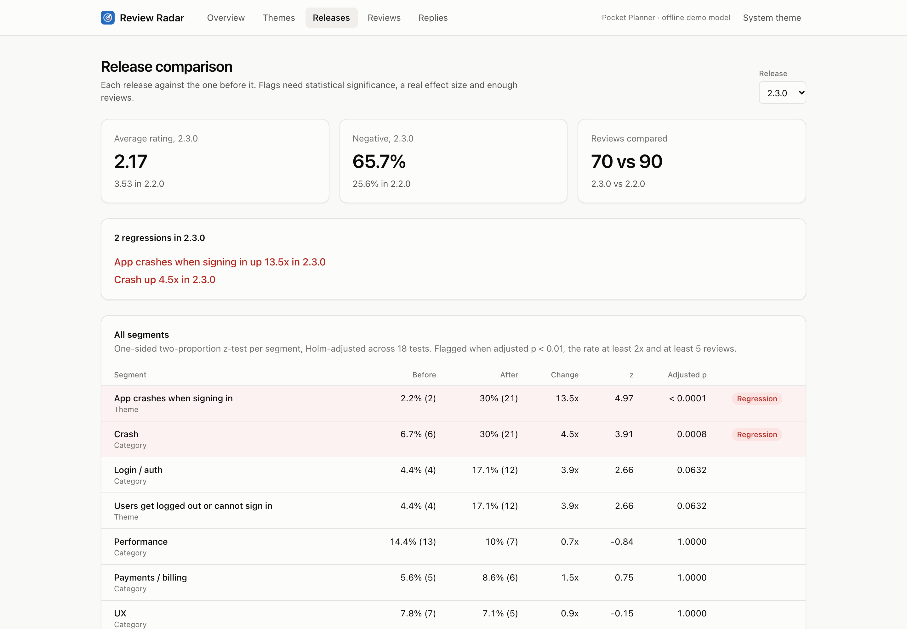
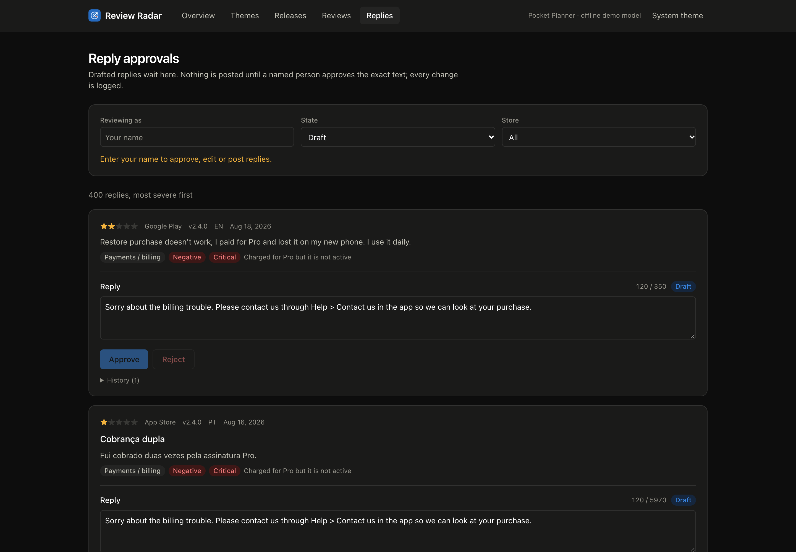
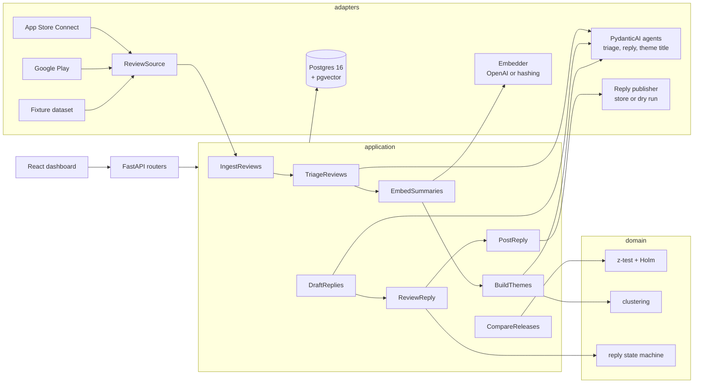

# Review Radar

**An agent that reads your App Store and Google Play reviews, groups them into themes, flags regressions after a release, and drafts replies that a person approves before anything is posted.**

[](https://github.com/OwaisMunawar/review-radar/actions/workflows/ci.yml)


[](LICENSE)



| Release comparison | Reply approvals |
| --- | --- |
|  |  |

All screenshots are captures of the running app on the bundled demo data (`make screenshots`). Light and dark versions of every page are in [`docs/screenshots`](docs/screenshots).

## Why

After a mobile release, the first signal that something broke is often a handful of one-star reviews in three languages, spread across two stores. Someone has to read them, notice that "crashes when I sign in", "se cierra al iniciar sesión" and "stürzt beim Anmelden ab" are the same bug, decide whether that is a real spike or normal noise, and then reply to each reviewer without promising anything the team can't deliver.

Review Radar does the reading and the arithmetic. It classifies every review into a typed triage, clusters the normalized summaries into themes, and runs a proper significance test per category and theme between each release and the one before it. It drafts replies too, but it never posts one: a named person approves the exact text, and every state change is written to an append-only audit log.

## Features

- **Ingestion from both stores** behind one `ReviewSource` protocol: App Store Connect (ES256 JWT), Google Play Developer API (service-account OAuth), and a fixture source for demo mode. Upserts are idempotent on `(store, review_id)` and keep edits.
- **Triage agent** (PydanticAI) with a typed `Triage` output: sentiment, category (crash, performance, login/auth, payments/billing, UX, feature request, praise, other), severity, app version and a short English summary. Runs in batches with a concurrency limit and retries; every model call's tokens and cost are stored in `llm_calls`.
- **Themes**: summaries are embedded into pgvector and clustered (average-linkage, cosine). Each theme gets a model-written title, a size, a 12-week sparkline, a trend and representative reviews. Similar-review lookup uses the HNSW index.
- **Release regression detection**: one-sided two-proportion z-test per segment, Holm-corrected across all segments, gated on effect size and minimum count. On the demo data it finds "App crashes when signing in up 13.5x in 2.3.0" and nothing in 2.3.1.
- **Reply drafting with human approval**: store-aware tone and length (Google Play's 350 characters, App Store's 5,970), states `draft → approved / edited → posted`, reject and reopen, dry-run posting without keys, and a database constraint that makes an unapproved post impossible.
- **Dashboard** (React 19): overview KPIs, themes, release comparison, a filterable review explorer and the approval queue. Keyboard accessible, light and dark.
- **Offline demo mode**: a deterministic PydanticAI `FunctionModel` and a local hashing embedder, so the whole stack runs with no API keys. Set `OPENAI_API_KEY` (or `MODEL=` for any PydanticAI provider) to use real models.
- **Evals**: 60 hand-labelled reviews, scored with `pydantic_evals` for accuracy, macro-F1 and a confusion matrix. CI fails below the threshold.

## Architecture



The backend is hexagonal. `domain/` is pure Python with no IO (models, statistics, clustering, the reply state machine). `application/` holds the use cases and the `Protocol` ports they depend on. `adapters/` implements those ports for Postgres, the stores and the models. `api/` is a thin FastAPI layer that receives its dependencies through `Depends`, and `container.py` is the single composition root. The decisions behind this, and the alternatives I rejected, are in [docs/ARCHITECTURE.md](docs/ARCHITECTURE.md).

## Tech stack

| Layer | Choice |
| --- | --- |
| Agents | PydanticAI 2.52 (typed outputs, output validators, `FunctionModel` for demo mode), `pydantic_evals` |
| API | FastAPI 0.142, Pydantic 2, pydantic-settings, structlog |
| Data | PostgreSQL 16, pgvector (HNSW, cosine), SQLAlchemy 2 async, asyncpg, Alembic |
| Stores | httpx, PyJWT (ES256 for Apple, RS256 for Google) |
| Web | React 19, Vite 8, TypeScript strict, TanStack Query 5, React Router, Tailwind 4, SVG charts |
| Types | mypy `--strict`, TS strict with `noUncheckedIndexedAccess`, API types generated from OpenAPI |
| Quality | ruff, ESLint (typed rules, jsx-a11y), Prettier, pytest + testcontainers, Vitest + Testing Library, Playwright |
| Tooling | uv, Docker Compose, GitHub Actions, Dependabot |

## Quick start

Requires Docker.

```bash
git clone https://github.com/OwaisMunawar/review-radar.git
cd review-radar
docker compose up --build
```

Open http://localhost:8080. On first boot the API migrates the database, loads the fictional Pocket Planner dataset (400 reviews, five releases, five languages), triages it with the demo model, builds themes and drafts replies. The API docs are at http://localhost:8000/docs.

For local development, `make dev-db` starts only Postgres, then run `uv run review-radar seed` and `uv run review-radar serve` in `backend/` and `npm run dev` in `web/`.

## Using real stores and real models

Copy `.env.example` to `.env`; compose picks it up automatically.

**Models.** Set `OPENAI_API_KEY` and Review Radar uses `openai:gpt-5.4-mini` for triage, replies and theme titles, and `text-embedding-3-small` (at 256 dimensions) for embeddings. Set `MODEL` to any PydanticAI model id to use another provider; embeddings then stay on the local hasher unless you set `EMBEDDING_MODEL` too. Prompts, schemas and validators are the same in both modes; only the model changes.

**App Store Connect.** Create an API key under Users and Access > Integrations, then set `APP_STORE_APP_ID`, `APP_STORE_ISSUER_ID`, `APP_STORE_KEY_ID` and either `APP_STORE_PRIVATE_KEY` or `APP_STORE_PRIVATE_KEY_PATH`.

**Google Play.** Give a service account access to the app in Play Console, then set `GOOGLE_PLAY_PACKAGE_NAME` and `GOOGLE_PLAY_SERVICE_ACCOUNT_FILE`. The Play API only returns the last week of reviews, so schedule `sync` at least daily.

Then pull and process new reviews:

```bash
docker compose run --rm api review-radar sync
```

**Posting.** Replies are posted only when store keys are configured **and** `POSTING_ENABLED=true`. Without both, "Post" records a `would_post` state with a note in the audit log, and those replies can be posted for real later.

## Evals

`make eval` (or `uv run review-radar eval` in `backend/`) runs triage over 60 hand-labelled reviews in five languages, written separately from the demo dataset, and prints accuracy, macro-F1, per-class F1, a confusion matrix and every miss. Measured in demo mode on 2026-09-30 ([docs/evals/demo.json](docs/evals/demo.json)):

| Model | Category accuracy | Category macro-F1 | Sentiment accuracy | Sentiment macro-F1 |
| --- | --- | --- | --- | --- |
| `demo` (keyword rules) | 95.0% | 0.945 | 88.3% | 0.872 |

Be careful with that first row. The demo model is a keyword rule list, and I widened its vocabulary after reading the misses on this set, so 95% measures how well it fits these 60 cases, not how well it generalizes. In CI it works as a regression guard: if a change to prompts, schemas or the pipeline breaks triage, the threshold (accuracy and macro-F1 ≥ 0.85) fails the build. The remaining misses are the honest hard cases: "freezes for a few seconds" is performance, not a crash, and "uses 2 GB of cache" has no keyword at all.

The number that matters is a real model's. To measure one:

```bash
cd backend
OPENAI_API_KEY=... uv run review-radar eval --model openai:gpt-5.4-mini --out ../docs/evals/gpt-5.4-mini.json
```

I haven't published a real-model row here yet because I'd rather show no number than one I didn't run.

## Quality

- **Types:** mypy `--strict` across `src`, `tests` and `scripts`; TypeScript strict with no `any`, and web types generated from the FastAPI OpenAPI schema (`npm run gen:api`).
- **Tests:** 108 backend tests, run against real Postgres 16 with pgvector (testcontainers locally, a service container in CI). They cover the upsert semantics, the audit trigger, the approval constraint, vector search and the full demo pipeline. Coverage on `domain` and `application` is 99% and CI enforces 90%. The web has Vitest + Testing Library tests for the UI primitives and the approval queue, plus a Playwright smoke test that runs against the compose stack in CI.
- **Errors:** every failure returns one envelope, `{"error": {"code", "message", "details"}}`, with stable codes (`not_found`, `invalid_transition`, `reply_invalid`, ...) mapped from typed exceptions.
- **Security:** secrets come only from the environment and are `SecretStr`; `.env.example` has no values; CORS is limited to configured origins; every endpoint validates its input; review text reaches the model as escaped XML data rather than instructions; posting needs both keys and an explicit switch.

```bash
make check   # lint, types, tests with coverage gate, eval threshold
make e2e     # Playwright smoke test against a running stack
```

## Roadmap

- Authentication and per-user roles, so the approver comes from a session rather than a name field.
- Incremental theme assignment against stored centroids instead of re-clustering everything, then HDBSCAN once volumes grow.
- Slack or email alerts when a regression is flagged.
- A published real-model eval row, and a held-out split so demo-rule tuning can't touch the test cases.
- Scheduled `sync` (a small worker, or a cron job in the compose file).

---

Built by [Owais Munawwar](https://github.com/OwaisMunawar). I'm available for React Native, AI and iOS work on [Upwork](https://www.upwork.com/freelancers/owaism11).
